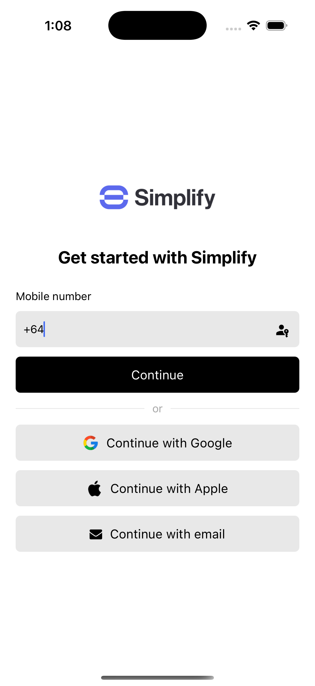

This is an example React Native app referenced in our [guide on how to integrate Authsignal with Amazon Cognito](https://docs.authsignal.com/integrations/aws-cognito/getting-started).

The example is inspired by the Uber app, using SMS OTP as the primary authenticator then prompting users to create a passkey.



The example also demonstrates how to implement the following:

- Capture and verify email address as part of the initial registration flow
- Register the mobile device for push auth

## Getting started

Copy `.env.example` and rename to `.env` then fill in the values for your Cognito user pool and Authsignal tenant.

```
AWS_REGION=
USER_POOL_CLIENT_ID=
API_GATEWAY_ID=
AUTHSIGNAL_TENANT=
AUTHSIGNAL_URL=
```

Then install dependencies and run the app.
